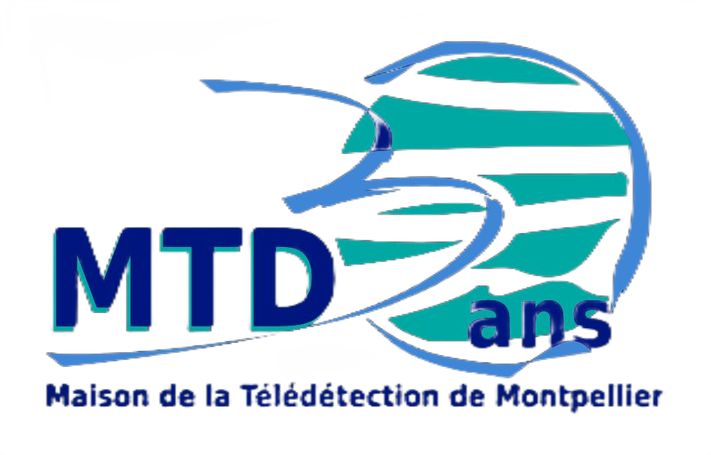

# Data Party les 30 ans de la MTD

Dans le cadre des 30 ans de la MTD, les différents organismes de la [Maison de la TéléDétection]() organise une journée dédiée à la Science Ouverte. Cette année, le sujet principal sera la visualisation de données à travers deux activités :

- Séminaire de 10h à 12h30
- Un challenge de 09h à 18h

## Programme Séminaire 

En cours de construction

## Challenge

### Description des Jeux de données proposés 

| Jeux de données                        | Description                                                                                   | Notebook Lié                                         | Information Géographique                            |
| ------------------------------------ | --------------------------------------------------------------------------------------------- | ---------------------------------------------------- | --------------------------------------------------- |
| Collection Hal d'Espace-Dev et Tetis | Génère un fichier CSV contenant les métadonnées des articles scientifiques (API Hal).          | [construction_dataset_hal.ipynb](notebooks/hal_dataset.ipynb) | Les pays des adresses d'affiliation des co-auteurs       |
| Jeux de données TETIS                | Combine les jeux de données déposées dans Recherche.Data.Gouv et Dataverse.Cirad (API Dataverse). | [data_tetis.ipynb](notebooks/data_tetis.ipynb)        | Terrain d'étude quand cela est renseigné |
| Jeux de données Espace-Dev           | Récupère les métadonnées de la collection Espace-Dev de DataSuds (API Dataverse).              | [data_espace-dev.ipynb](notebooks/data_espace-dev.ipynb) | Terrain d'étude quand cela est renseigné    |
| Jeux de données OpenIG               | Récupère les métadonnées des jeux de données via l'IDG d'OpenIG (API CKAN).                   | [data_openig.ipynb](notebooks/data_openig.ipynb)      | -  |

---

## Organisateurs

 | Prénom   | Nom     | Institut      |
|-----------|----------|---------------|
| Rémy      | Decoupes | TETIS         |
| Vincent   | Delbar   | Telescop      |
| Laurent   | Demagistri| EspaceDev    |
| Etienne   | Duperron | Nitidae       |
| Nadia     | Guiffant | TETIS         |
| Michaël   | Viadere  | OpenIG        |