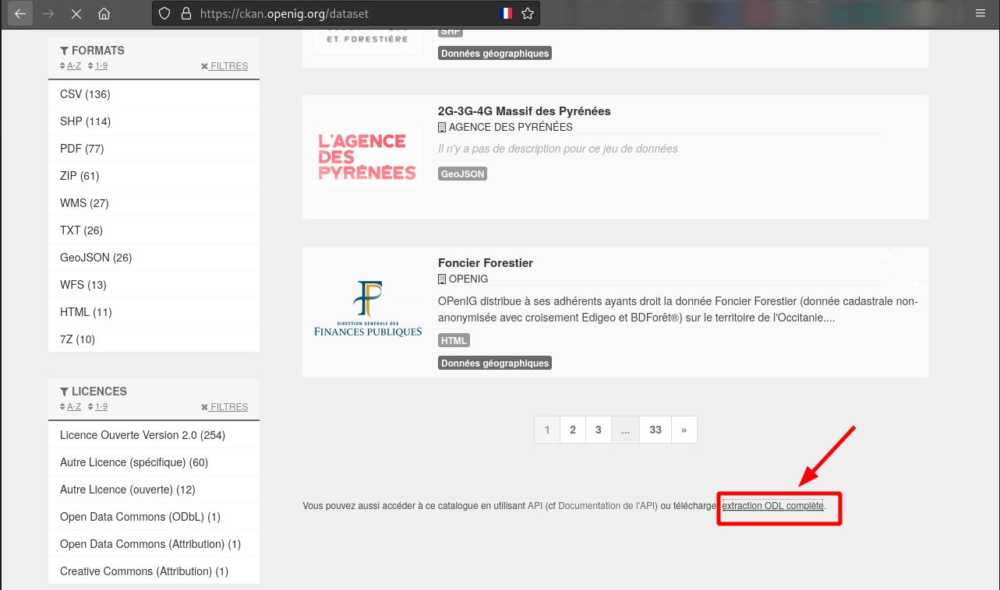

**Constitution des jeux de données pour le Challenge de la Data party**

*Les 30 ans de la MTD*

# Les jeux de données Open IG

Site de téléchargement : [https://ckan.openig.org/](https://ckan.openig.org/)

1. Se rendre sur le site
2. Télécharger l'ensemble des métadonnées comme ci-dessous ou bien en ligne de commande : `wget -O data/data_openig.csv "https://ckan.openig.org/dataset/export?resformat=odl"`

